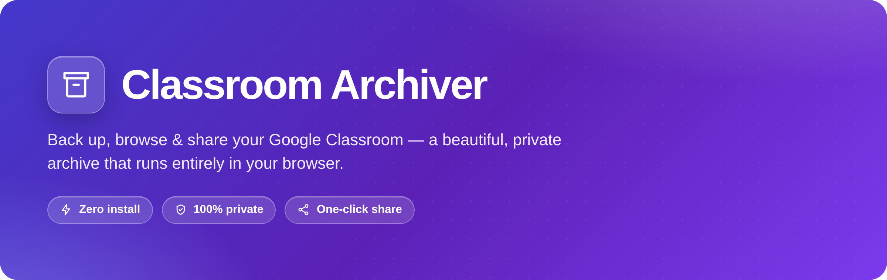
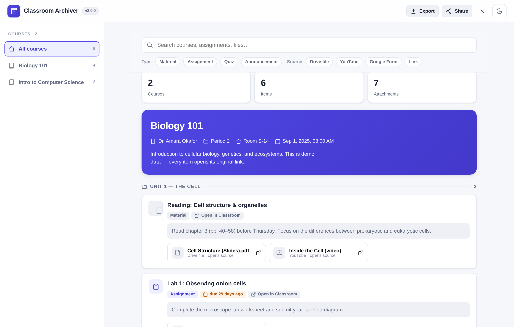
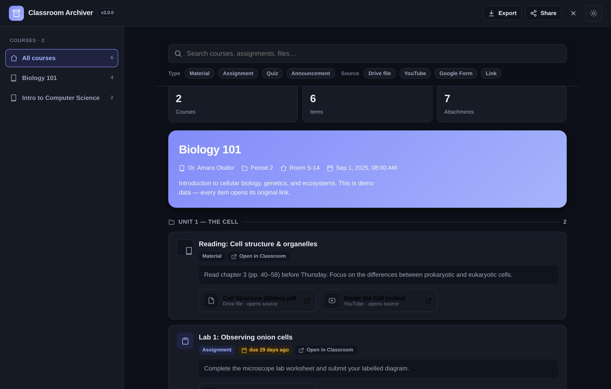
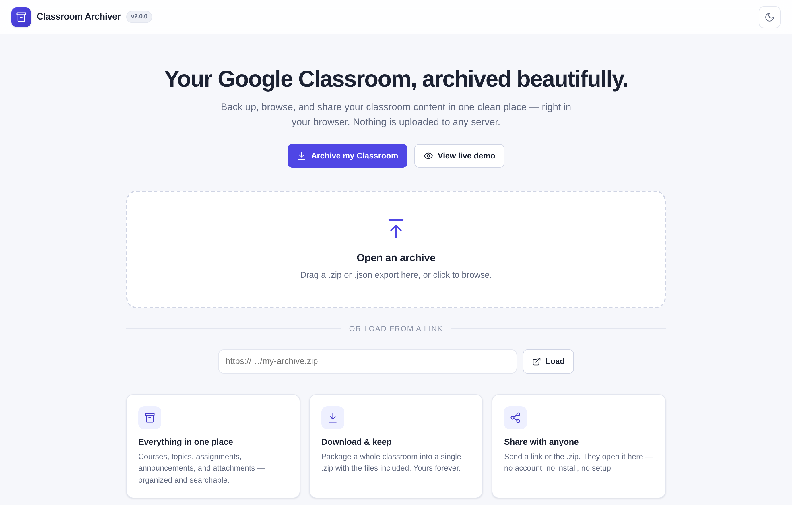
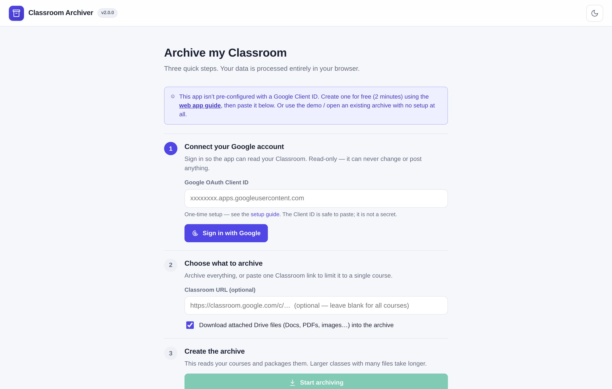
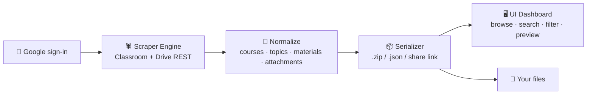

<div align="center">



<h3>Back up, browse &amp; share your Google Classroom — beautifully, and 100% in your browser.</h3>

<p>
No install. No terminal. No data leaves your device.<br>
Crawl a whole classroom, package it into a single file, and share it with a link anyone can open.
</p>

<p>
<a href="https://grloper.github.io/classroom-downloader/"></a>
&nbsp;
<a href="docs/web-app-guide.md"></a>
</p>

<p>
<a href="https://github.com/grloper/classroom-downloader/actions/workflows/ci.yml"></a>
<a href="https://github.com/grloper/classroom-downloader/actions/workflows/pages.yml"></a>
<a href="LICENSE"></a>
<a href="https://github.com/grloper/classroom-downloader/stargazers"></a>


</p>

<p><sub>Created &amp; maintained by <a href="https://github.com/grloper"><b>@grloper</b></a></sub></p>

<sub><a href="https://grloper.github.io/classroom-downloader/">Live&nbsp;Demo</a> · <a href="docs/web-app-guide.md">User&nbsp;Guide</a> · <a href="docs/refactor-strategy.md">Architecture</a> · <a href="https://github.com/grloper/classroom-downloader/issues/new">Report&nbsp;Bug</a> · <a href="https://github.com/grloper/classroom-downloader/issues/new">Request&nbsp;Feature</a> · <a href="https://github.com/grloper">@grloper</a></sub>

</div>

<br>

<div align="center">

<picture>
  <source media="(prefers-color-scheme: dark)" srcset="docs/assets/web-viewer-dark.png">
  
</picture>

<sub>The dashboard, in your browser — search, filter, and browse every course, assignment, and file. <i>(Adapts to your light/dark theme.)</i></sub>

</div>

<br>

## ✨ Why Classroom Archiver?

Google Classroom is where your coursework lives — until the term ends, access is revoked, or you graduate, and it's gone. Classroom Archiver makes your own **permanent, private, portable copy** in seconds, and lets you share it as easily as a link.

- 🗂️ **Everything in one place** — courses, topics, assignments, quizzes, announcements, due dates, descriptions, and attachments, all organized and instantly searchable.
- ⚡ **Zero setup for viewing** — open the site, drop in an archive, and browse. No account, no install, no build step.
- 📦 **One-click export** — package a whole classroom (including downloaded Drive files) into a single `.zip`, or a tiny metadata `.json`.
- 🔗 **Share with anyone** — send a link or the file; they open it in the same app with nothing to install.
- 🔒 **Private by design** — everything runs locally in your browser. Read-only Google access; your data never touches a server we control.
- 🖥️ **Power-user CLI too** — a local-first engine for bulk downloads and automation, producing the exact same archive format.

## 🚀 Quick start

**Just want to look around?** → **[Open the live demo](https://grloper.github.io/classroom-downloader/)** and click **"View live demo."** That's it.

**Archive your own Classroom** (in the browser):

1. Open the app → **Archive my Classroom**.
2. Paste a free Google **OAuth Client ID** (one-time, ~2 min — the [guide](docs/web-app-guide.md) walks you through it) and **Sign in with Google** (read-only).
3. Click **Start archiving** → then **Export** to save a `.zip`, or **Share** to get a link.

**Run the app locally** (optional — no dependencies needed):

```bash
git clone https://github.com/grloper/classroom-downloader.git
cd classroom-downloader
npm run web        # → http://127.0.0.1:8080
```

> [!NOTE]
> Reading your own Classroom requires a Google OAuth Client ID — that's a Google
> policy for the Classroom/Drive APIs, not a limitation we can remove. It's free,
> takes ~2 minutes, and the [Web App Guide](docs/web-app-guide.md) covers every step.
> **Viewing and sharing archives needs none of this.**

## 🎬 See it in action

<div align="center">
<table>
<tr>
<td width="50%"><br><sub align="center"><b>Browse &amp; search</b> — courses, topics, assignments, files</sub></td>
<td width="50%"><br><sub><b>Light &amp; dark</b> — easy on the eyes, day or night</sub></td>
</tr>
<tr>
<td width="50%"><br><sub><b>Drop to open</b> — any <code>.zip</code>/<code>.json</code> archive, or a link</sub></td>
<td width="50%"><br><sub><b>Guided archiving</b> — three simple steps, all in-browser</sub></td>
</tr>
</table>
</div>

## 🧩 Two ways to use it

Both paths are read-only against Google and produce the **same portable archive** — a course crawled by one opens perfectly in the other.

| | 🌐 **Web App** | 🖥️ **Local Engine** |
|---|---|---|
| **Install** | None — runs in your browser | Node.js, or a packaged executable |
| **Sign-in** | One click (Google Identity Services) | Desktop OAuth client + JSON upload |
| **Best for** | Browsing, backing up, and **sharing** | Large downloads, automation, scripting |
| **Output** | `master_index.json` graph · `.zip` export | Same `master_index.json` graph · SQLite |
| **Lives in** | [`web/`](web/) → GitHub Pages | [`src/`](src/) → `npm run engine` or a release binary |

## 🔒 Privacy

- **Local only.** Course data, tokens, and files are processed entirely in your browser (web app) or on your machine (CLI). There is no backend.
- **Read-only.** The app requests read-only Classroom & Drive scopes — it can never post, edit, or delete anything in your account.
- **Shares are safe.** An inline share link contains public metadata and original links only — never a file that lives solely on your disk.
- **Ephemeral tokens.** The browser access token is short-lived, held in memory, and revoked on sign-out.

## 🏗️ How it works

Three cleanly separated layers — the same shape in the web app and the CLI:



| Layer | Web App | CLI Engine |
|---|---|---|
| **Scraper Engine** | [`web/src/scraper/`](web/src/scraper) — browser Google auth + REST | [`src/auth`](src/auth) · [`src/crawler`](src/crawler) · [`src/downloaders`](src/downloaders) |
| **Serializer** | [`web/src/archive/`](web/src/archive) — `.zip`/`.json`/share | [`src/storage`](src/storage) — SQLite + `master_index.json` |
| **UI Dashboard** | [`web/src/ui/`](web/src/ui) — searchable viewer | [`src/api`](src/api) — local `127.0.0.1` dashboard |

> 📐 The full design rationale — and why the browser can do this at all — is in
> **[docs/refactor-strategy.md](docs/refactor-strategy.md)**.

<details>
<summary><b>🖥️ Local Engine — advanced / bulk downloads</b></summary>

<br>

An API-first crawler with a Playwright session fallback. It discovers accessible
courses, crawls topics/coursework/materials/announcements, downloads Drive assets
where permitted, writes SQLite metadata, and exports `output/master_index.json`.

**Standalone executables** (no Node.js required) are published on every tagged
release — download from [Releases](https://github.com/grloper/classroom-downloader/releases),
drop the file in an empty folder, and run it. See the [CLI user guide](docs/user-guide.md).

**From source:**

```bash
npm install
cp .env.example .env
npm run ui        # dashboard + engine   (or: npm run engine)
```

First run performs preflight checks, opens Google OAuth in your browser, saves a
token, crawls, downloads accessible Drive files, and writes SQLite + JSON. Later
runs skip login and resume.

<details>
<summary>Commands &amp; flags</summary>

```bash
npm run engine            # preflight, login if needed, crawl, download, export
npm run doctor            # check local credentials/token/database setup
npm run login             # auth-only repair command
npm run export            # regenerate JSON from SQLite
npm run build:standalone  # build a portable executable for this OS
npm run web               # preview the web app locally (no deps)
npm test                  # unit tests (engine + web app)
npm run release:check     # check, test, sanitize, compliance, audit

npm run engine -- --no-download    # metadata only
npm run engine -- --export-only    # rebuild JSON from SQLite
npm run engine -- --plan-only      # crawl + write a download plan, no files
```

</details>

The engine's own local-only dashboard (`npm run ui`, bound to `127.0.0.1`):

<div align="center">

</div>

</details>

## 🗺️ Roadmap

- [ ] Selective scraping in the web app (pick courses/items before downloading)
- [ ] Offline / PWA install of the viewer
- [ ] Richer inline previews for Office document formats
- [ ] Optional fully-offline `.zip` (viewer bundled inside the archive)

See [docs/ui-roadmap.md](docs/ui-roadmap.md) for details.

## 🤝 Contributing

Contributions are welcome! The web app has **no build step and no dependencies** —
clone, run `npm run web`, and edit files in [`web/`](web/).

```bash
npm test            # unit tests (dependency-free for the web modules)
npm run check       # syntax-check engine + web app
```

Found a bug or have an idea? [Open an issue](https://github.com/grloper/classroom-downloader/issues/new) or send a PR.

## 🛠️ Built with

<p>


</p>

## ⭐ Star history

If Classroom Archiver is useful to you, consider giving it a star — it genuinely helps.

<a href="https://star-history.com/#grloper/classroom-downloader&Date">
  
</a>

## 👤 Author

Built and maintained by **[@grloper](https://github.com/grloper)**.

<a href="https://github.com/grloper"></a>

Questions, ideas, or want to contribute? [Open an issue](https://github.com/grloper/classroom-downloader/issues/new) or reach me on GitHub at **[github.com/grloper](https://github.com/grloper)**.

## 📄 License

Released under the [MIT License](LICENSE) © [@grloper](https://github.com/grloper).

<div align="center"><sub>Made for students, teachers, and schools by <a href="https://github.com/grloper">@grloper</a>. Your classroom, yours to keep.</sub></div>
