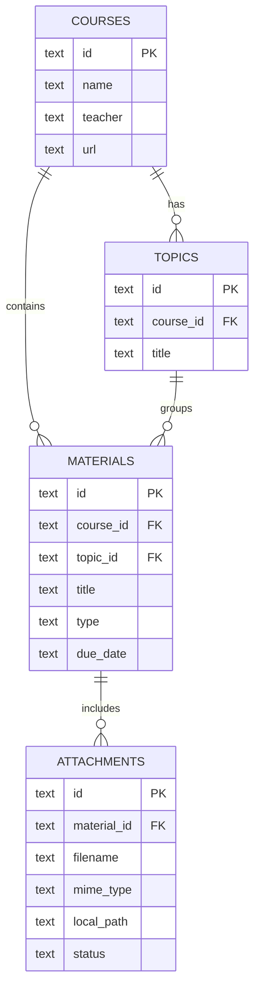
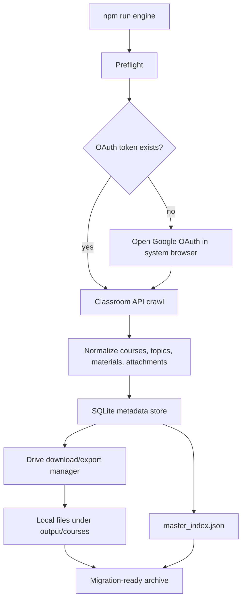

# Classroom Archiver

[](https://github.com/grloper/classroom-downloader/actions/workflows/ci.yml)
[](https://github.com/grloper/classroom-downloader/actions/workflows/pages.yml)

Back up, browse, and share your Google Classroom content — as a **zero-install
web app**, or as a **local-first CLI engine** for bulk downloads and automation.
Both produce the same portable archive format, so a course crawled by one
opens cleanly in the other.

---

## Two ways to use it

| | 🌐 Web App | 🖥️ Local Engine |
| --- | --- | --- |
| Install | **None** — runs in your browser | Node.js, or a packaged executable |
| Sign-in | One click (Google Identity Services) | Desktop OAuth client + JSON upload |
| Best for | Browsing, backing up, and **sharing** | Large downloads, automation, scripting |
| Output | `master_index.json` graph, `.zip` export | Same `master_index.json` graph, SQLite |
| Where | [`web/`](web/) → GitHub Pages | [`src/`](src/) → `npm run engine` or a release executable |

Both halves are read-only against Google — neither can post, edit, or delete
anything in your Classroom or Drive.

---

## 🌐 Web App (recommended)

A static, no-build app: archive, browse, and share Classroom content entirely
in your browser. Nothing is uploaded to any server.

- **Scraper Engine** (`web/src/scraper/`) — browser-side Google sign-in + Classroom/Drive REST.
- **Export/Import Serializer** (`web/src/archive/`) — one-click `.zip`/`.json` export and share links.
- **UI Dashboard** (`web/src/ui/`) — a clean, searchable, filterable, light/dark viewer.

**Try it now — zero setup:**

```bash
npm run web        # preview locally at http://127.0.0.1:8080
```

Open the app and click **"View live demo"**, or drag in any `.zip`/`.json` archive.
Viewing and sharing need no account at all.

To **archive your own Classroom**, one free one-time step is unavoidable —
Google requires an OAuth Client ID for the Classroom/Drive APIs. The web app
reduces this to pasting one non-secret value (~2 minutes); see the guide below.

- 📘 **[Web App Guide](docs/web-app-guide.md)** — viewing, archiving, and sharing.
- 🧭 **[Strategy & Refactor Plan](docs/refactor-strategy.md)** — why and how the app is structured.
- 📄 **[web/README.md](web/README.md)** — developer notes for the app itself.

### Deploying the web app

1. Push to `main` (the [`Deploy Web App`](.github/workflows/pages.yml) workflow uploads `web/`).
2. In **Settings → Pages**, set **Source: GitHub Actions**.
3. Add your Pages origin (e.g. `https://<owner>.github.io`) to your OAuth
   client's **Authorized JavaScript origins** for one-click sign-in.

---

## 🖥️ Local Engine (advanced / bulk downloads)

An API-first Google Classroom crawler with a Playwright session fallback. It
discovers accessible courses, crawls topics/coursework/materials/announcements,
downloads Drive assets where permitted, writes SQLite metadata, and exports
`output/master_index.json` for migration into another platform.

**What it does:**

- Crawls all Classroom courses visible to the authorized Google account.
- Reads topics, coursework, materials, announcements, due dates, descriptions, and attachments.
- Downloads accessible Google Drive files; exports Docs/Slides/Sheets/Drawings to portable formats.
- Saves YouTube, Forms, and external links as structured references.
- Stores metadata in SQLite and JSON; resumes interrupted runs and skips completed downloads.
- Keeps credentials, tokens, logs, databases, browser sessions, and downloaded files local-only.

It also has its own local-only dashboard (`npm run ui`, bound to `127.0.0.1`)
for browsing what's been downloaded and picking what to archive:


*The "Archive" view visualizes downloaded courses, topics, materials, and assignments.*


*The "Download Plan" view lets you preview and select exactly what to archive.*


*An overview of the local database layout and archive telemetry.*


*Manage local settings and configuration, including database reset, from the dashboard.*

### Standalone executable (no coding required)

Windows, macOS, and Linux executables are published on every tagged release —
no Node.js, Playwright, or Docker required.

1. Go to the [GitHub Releases](https://github.com/grloper/classroom-downloader/releases) page.
2. Download the executable for your OS (`classroom-downloader-win.exe`, `classroom-downloader-mac`, or `classroom-downloader-linux`).
3. Place it in an empty folder — it creates its output/database folders next to itself.
4. Run it. It opens the local dashboard in your browser.
5. Follow the [user guide](docs/user-guide.md) to upload your Google OAuth Desktop app JSON, sign in, choose what to download, and start the archive.

Google requires every user or school to create their own OAuth Desktop app
before first login; the dashboard walks you through uploading that JSON and
keeps the token on your computer only.

### Quick start (for developers)

1. Install dependencies:

   ```bash
   npm install
   ```

2. Copy `.env.example` to `.env` and adjust paths/settings.

3. Do the one manual Google Cloud setup Google requires before first login:

   - Open the Google Cloud project you'll use for this archive engine.
   - Enable **Google Classroom API** and **Google Drive API**.
   - Open **Google Auth Platform** → **OAuth consent screen**.
   - Keep the app in **Testing** mode for personal/dev use.
   - Under **Audience** → **Test users**, add every Google account you may sign in with.
   - Create an OAuth client of type **Desktop app**.
   - Download the client JSON to `credentials/oauth-client.json`.

   Skipping the test-user step causes Google to show:

   ```text
   Access blocked: app has not completed the Google verification process
   Error 403: access_denied
   ```

4. Run the dashboard UI, or just the background engine:

   ```bash
   npm run ui        # dashboard + engine
   npm run engine    # engine only
   ```

   On first run, the engine performs preflight checks, opens Google OAuth in
   your normal browser, saves the token, crawls Classroom, downloads
   accessible Drive files, writes SQLite, and exports JSON. Later runs skip
   login and resume the archive:

   ```bash
   npm run engine
   ```

### Commands

```bash
npm run engine            # preflight, login if needed, crawl, download, export
npm run backup             # same as engine
npm run doctor              # check local credentials/token/database setup
npm run login                # auth-only repair command
npm run crawl                 # low-level crawl/download/export command
npm run export                 # regenerate JSON from SQLite
npm run api                     # local JSON API for the dashboard
npm run build:standalone        # build a local portable executable for this OS
npm run web                     # preview the web app locally (no deps)
npm run check                   # syntax-check the engine + the web app
npm test                        # unit tests (engine + web app)
npm run sanitize:check          # verify public files contain no obvious private data
npm run compliance:check        # validate local-only and release safety rules
npm run release:check           # check, test, sanitize, compliance, audit
```

Useful crawler flags:

```bash
npm run engine -- --no-download
npm run engine -- --export-only
npm run engine -- --api-only
npm run engine -- --ui-only
```

### Output

```text
output/
  courses/
    Math_Class/
      Algebra/
        Quadratics/
          worksheet.pdf
          lesson.docx
          lesson.pdf
          assignment.json
  master_index.json
database/
  classroom.db
logs/
  archiver.log
```

### Security notes

`GOOGLE_PASSWORD` is intentionally not used. Google accounts commonly require
MFA, risk checks, and browser-bound trust state; scripting a password flow is
brittle and unsafe. Run `npm run engine`, complete Google auth in the normal
browser when prompted, and future runs use the local token file. Tokens and
downloaded archives are ignored by git.

If you see "Couldn't sign you in. This browser or app may not be secure",
close the Playwright browser and rerun `npm run engine` — do not use the
Playwright browser for Google sign-in unless you specifically need UI
fallback testing.

If you see `Error 403: access_denied` and Google says the app has not
completed verification, add the signing-in Google account under **Google
Auth Platform** → **Audience** → **Test users**, then rerun `npm run engine`.

---

## Data model

Both the web app and the local engine share this shape — an archive from
either one opens in either viewer.



### Local engine crawl flow



### Classroom/Drive API coverage

- `courses.list`, `courses.teachers.list`, `courses.topics.list`
- `courses.courseWork.list`, `courses.courseWorkMaterials.list`, `courses.announcements.list`
- `drive.files.get`, `drive.files.export`

References: [coursework](https://developers.google.com/workspace/classroom/reference/rest/v1/courses.courseWork/list) ·
[materials](https://developers.google.com/workspace/classroom/reference/rest/v1/courses.courseWorkMaterials/list) ·
[topics](https://developers.google.com/workspace/classroom/reference/rest/v1/courses.topics/list) ·
[Drive export](https://developers.google.com/drive/api/v3/reference/files/export)

---

## Public repo safety

The repository is designed to be public-safe. The following are ignored by git:

- `.env`
- `credentials/*.json`
- `sessions/**`
- `database/*.db`, `database/*.db-*`
- `logs/**`
- `output/master_index.json`, `output/courses/**`

Before publishing, run:

```bash
npm run release:check
```

## CI/CD

- **Validation** (`ci.yml`) — syntax check, unit tests, sanitize/compliance
  checks, and a dependency audit on Node.js 20 and 22, for every push/PR to
  `main`, `develop`, and `staging`.
- **Deploy Web App** (`pages.yml`) — publishes `web/` to GitHub Pages on every
  push to `main` that touches it (or on demand).
- **Release** (`release.yml`) — on a `vX.Y.Z` tag, builds Windows/macOS/Linux
  standalone executables and publishes a GitHub Release.
- Weekly Dependabot checks for npm and GitHub Actions dependencies.

See [docs/environments.md](docs/environments.md) for branch, staging,
production, and compliance gates.

## Roadmap

- Selective scraping in the web app (choose courses/items before downloading),
  matching the local engine's `--plan-only` / `--select` flow — see
  [docs/ui-roadmap.md](docs/ui-roadmap.md) and
  [docs/prompts/selective-download-ui.prompt.json](docs/prompts/selective-download-ui.prompt.json).
- Offline/PWA install of the web viewer.
- Richer inline previews for Office document formats.

## License

See [LICENSE](LICENSE).
